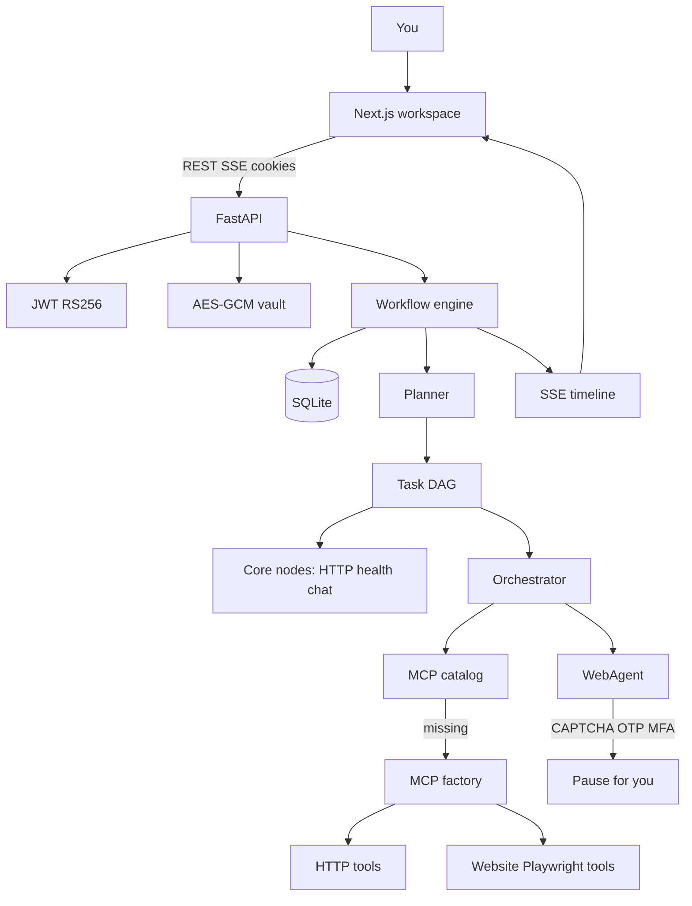
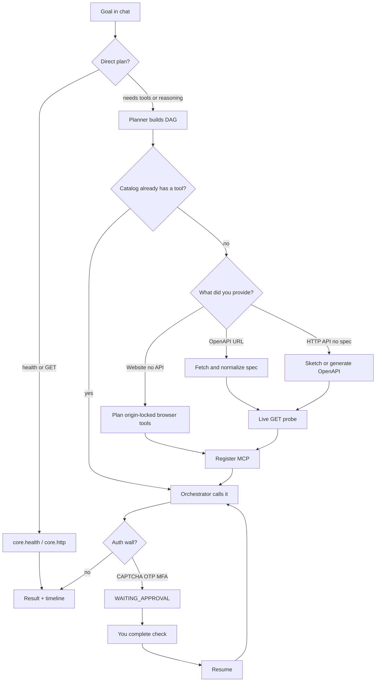
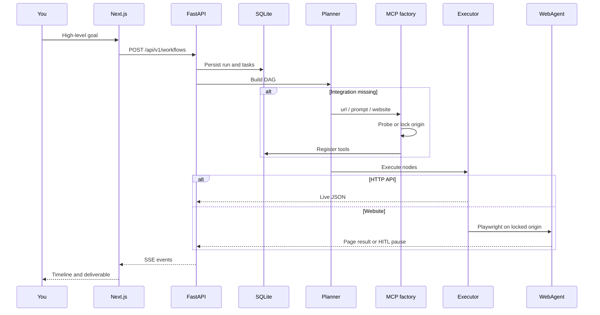

# AgentOS

**Tell it what you want. It builds the tools and does the work.**

AgentOS is an autonomous AI workspace. You describe an outcome in plain language. A planner turns that into a DAG of tasks. If the tools needed to finish the work do not exist yet, the MCP factory **builds them**, probes them live, registers them, and the orchestrator continues in the same run.

It is not a chatbot with canned replies. Runs hit live HTTP APIs, a real browser, site health checks, an encrypted vault, resume generation, and an action timeline of what the agents actually did.

**Stack:** Next.js (port 3000) · FastAPI (port 8000) · SQLite locally · Firestore on Cloud Run · Gemini (AI Studio key locally, or Vertex on GCP).

## Local and cloud

The same codebase runs in both places. One setting switches storage; Gemini follows the key.

| | Laptop | Google Cloud |
| --- | --- | --- |
| How | `python main.py` + `npm run dev` | Cloud Run (`docs/deploy-gcp.md`) |
| Storage | `STORAGE_BACKEND=sqlite` | `STORAGE_BACKEND=firestore` |
| Gemini | `GEMINI_API_KEY` (AI Studio) | Leave the key empty; Vertex uses `GOOGLE_CLOUD_PROJECT` + the Cloud Run service account |
| Secrets | `.env` (gitignored) | Secret Manager |
| Data | `data/agentos.db` | Firestore (survives scale-to-zero) |

Repository: [umangvijay/AgenticOS-Google-DEVPOST-](https://github.com/umangvijay/AgenticOS-Google-DEVPOST-)

## Features

- **Dynamic MCP factory** — three ways to get tools: an OpenAPI URL, a description of any HTTP API with no spec, or a website with no API (origin-locked Playwright tools). Not a reverse-engineered private API.
- **Chat-first automation** — workspace chat plans, builds missing integrations mid-run, then calls the new tools. Follow-up messages reuse the catalog.
- **Orchestrator + DAG engine** — planner *is* the decomposer. Core nodes (HTTP, health, chat) run without a model.
- **Self-healing** — timeouts, network errors, and 429/quota retry. CAPTCHA, OTP, and MFA pause for you instead of being treated as failures.
- **Human-in-the-loop** — AgentOS never fills CAPTCHA, SMS OTP, or MFA. Complete the check, then Resume.
- **Vault** — AES-256-GCM credentials. After save, the API returns names only.
- **ATS resume** — scan against a job description, tailor from notes, HTML preview and download.
- **Studio** — site health, debug (code is not executed), generate a downloadable site or app.
- **Action timeline** — SSE events from the live run, not a fake progress bar.
- **Guest workspace** — try the product without creating an account first.

### MCP from chat

| You have | You type | What gets built |
| --- | --- | --- |
| OpenAPI URL | `Create MCP tools from https://…/openapi.json then list …` | HTTP tools from the spec, live-probed, then called |
| HTTP API, no spec | `Build MCP tools for [app] so I can [list / get / create …]` | HTTP tools on the public host (GitHub, Open-Meteo, PokeAPI, …) |
| Website, no API | Vault login, then `Create MCP tools for https://…`, then `Log in with vault credential NAME and use runOnSite …` | Browser tools (`runOnSite`, `login`, …) locked to that origin |

Same three paths exist on **Integrations → Create**.

## Architecture

Next.js is the workspace UI. FastAPI owns auth, the vault, the MCP registry, and the workflow engine. The engine plans a DAG, the MCP factory fills gaps, and Playwright runs only on a locked origin.



## Flowchart

What happens after you send a goal.



## Data flow



Local stores: `data/agentos.db` (users, runs, tasks, MCP registry), vault ciphertext in SQLite, JWT keys under `backend/security/keys/` (gitignored). Optional cloud persistence is Firestore — see [docs/architecture.md](docs/architecture.md).

## Quick start

```bash
cd "AgenticOS(Google DEVPOST)"
python3 -m venv .venv && source .venv/bin/activate
pip install -r requirements.txt
playwright install chromium
cp .env.example .env   # set GEMINI_API_KEY
.venv/bin/python main.py
cd frontend && npm install && npm run dev
```

- App: http://localhost:3000
- API: http://127.0.0.1:8000
- In-app docs: http://localhost:3000/docs

Copy `.env.example` to `.env`. Set `GEMINI_API_KEY` for local. Do not commit `.env`. Cloud Run + Vertex + the $100 kill switch: [docs/deploy-gcp.md](docs/deploy-gcp.md).

## Docs

- [Architecture](docs/architecture.md)
- [MCP builder](docs/mcp-builder.md)
- [Automation](docs/automation.md)
- [User guide](docs/user-guide.md)
- [Security](docs/SECURITY.md)
- [Environment setup](docs/environment-setup.md)
- [Google Cloud deploy](docs/deploy-gcp.md) — redeem credits, Vertex Gemini (no API key), Cloud Run, **$100 kill switch**
- [Diagrams](docs/diagrams/)

## Honest limits

- Website MCP is **UI automation**, not a hidden official API.
- CAPTCHA, SMS OTP, and bank MFA require you. AgentOS will not complete them for you.
- Paid APIs (for example live Stripe charges) need your own keys in the vault.
