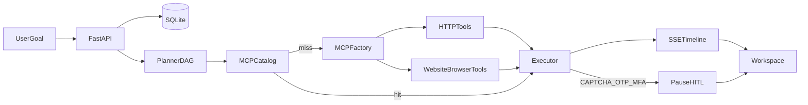

# Architecture

AgentOS is a local-first autonomous workspace. The laptop default is SQLite + an in-process worker. Firestore / Pub/Sub / Cloud Run remain optional when `STORAGE_BACKEND=firestore`.

## Tagline

Tell it what you want. It builds the tools and does the work.

## Runtime

```
Browser (Next.js :3000)
        │  REST + SSE + cookies
        ▼
FastAPI (:8000)
  auth, contact SMTP, credentials vault, MCP registry,
  workflows, resume, studio, approvals
        │
        ▼
Workflow engine (DAG)
  Intent → Planner (task decomposition) → execute
        │
        ├── core.http / core.health / core.chat / core.mcp_build
        ├── Orchestrator + MCP tool catalog
        └── WebAgent (Playwright, origin-locked)
```

Planner **is** the decomposer. There is no third LLM hop named Decomposer.

## Dynamic MCP (three paths)

1. Discover: does a registered tool match the goal?
2. If yes → use it (`pick_catalog_tool` scores name, MCP, and description against the follow-up text).
3. If no → MCP factory:

| Path | Planner method | Factory | Execution |
| --- | --- | --- | --- |
| OpenAPI / Swagger URL | `url` | Fetch, normalize, generate schemas, probe a safe GET | HTTP tools |
| HTTP API, no spec | `prompt` | Gemini spec **or** sketched OpenAPI against a known public host | HTTP tools |
| Website, no API | `website` | Playwright tool plan locked to origin | `runOnSite`, `login`, `openHome`, … |

Chat and **Integrations → Create** share this factory. The next task in the same run, or the next message in the thread, can call the new tools.

## Data stores (local)

| Store | Path / table |
| --- | --- |
| SQLite | `data/agentos.db` — users, runs, tasks, events, MCP registry, schedules |
| Vault ciphertext | secrets table, AES-256-GCM |
| Contact inbox | `data/contact_inbox.json` plus SMTP to `CONTACT_TO_EMAIL` |
| JWT keys | `backend/security/keys/*.pem` (gitignored) |

## Data flow



## Self-healing

Retryable: timeouts, network, 429/quota. Semantic errors can enter RECOVERING when `recovery_enabled` (default on new tasks). Not retried: SSRF, 401/403, CAPTCHA/OTP/MFA (those pause).

## Optional cloud mode

Cloud Run + Secret Manager is the hosting path ([deploy-gcp.md](deploy-gcp.md)). Diagrams under `docs/diagrams/14-terraform-gcp.md` describe Terraform. They are not the local architecture. SQLite files do not survive Cloud Run scale-to-zero; use Firestore for durable cloud data.
