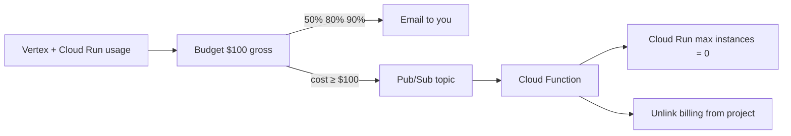

# Deploy AgentOS on Google Cloud ($150 credits)

This is the full path: redeem credits, use **Vertex AI Gemini** (project quotas, not an AI Studio key), deploy Cloud Run, and install a **$100 kill switch**.

Google Cloud has **no hard spending cap**. A budget only emails you unless you attach a function that stops the project. This repo’s function scales Cloud Run to zero and unlinks billing when reported usage reaches **$100**. That leaves **~$50** of a $150 grant as a buffer because budget notices can lag. Official pattern: [Disable billing with notifications](https://cloud.google.com/billing/docs/how-to/disable-billing-with-notifications).

Do this in [Google Cloud Shell](https://shell.cloud.google.com) or a laptop with the [gcloud CLI](https://cloud.google.com/sdk/docs/install). Replace `YOUR_PROJECT_ID` everywhere.

---

## 1. Redeem the credit code

1. Sign in at [console.cloud.google.com](https://console.cloud.google.com) with the Google account that owns the code.
2. Open **Billing** → **Credits** / **Offers**, or go directly to [console.cloud.google.com/billing](https://console.cloud.google.com/billing).
3. Use **Redeem promo code** / **Apply promotion** and paste the code. If the code is from a program (hackathon, education, startup), their email usually has the exact redeem URL.
4. Confirm the credit shows on **the billing account you will attach to this project** (amount, expiry). Credits are per billing account, not per project.
5. If you also have a free-trial card hold, that is separate. Promo credits still need a billing account; they just pay the invoice until they run out.

You cannot spend the grant until a **project is linked** to that billed account.

---

## 2. Create a project and attach billing

```bash
gcloud auth login
gcloud auth application-default login

# Optional: create a dedicated project so the kill switch cannot take down unrelated work
gcloud projects create YOUR_PROJECT_ID --name="AgentOS"
gcloud config set project YOUR_PROJECT_ID

gcloud billing accounts list
# Copy the ACCOUNT_ID (XXXXXX-XXXXXX-XXXXXX)

gcloud billing projects link YOUR_PROJECT_ID --billing-account=ACCOUNT_ID
```

Use **one project for AgentOS only**. If the kill switch unlinks billing, everything in that project stops.

---

## 3. Vertex Gemini (higher RPM / TPM) vs AI Studio key

| | AI Studio API key (`GEMINI_API_KEY`) | Vertex AI on this project |
| --- | --- | --- |
| Auth | Key string | Cloud Run service account (no key in `.env`) |
| Quotas | AI Studio free / pay-as-you-go limits | **Vertex paid quotas** on the billed project (typically much higher RPM/TPM) |
| Pays from | Often a different Google AI billing | **This GCP billing account / your $150 credits** |
| AgentOS | Set `GEMINI_API_KEY` | Leave `GEMINI_API_KEY` **empty**; set `GOOGLE_CLOUD_PROJECT` + `GOOGLE_CLOUD_REGION` |

This repo already switches automatically (`backend/services/gemini_client.py`): if there is no API key, it uses `vertexai=True` with your project and region.

**Do not** mount an AI Studio key on Cloud Run if you want Vertex quotas. A vault key named `gemini` also forces the API-key path.

Enable Vertex and grant the Cloud Run runtime identity:

```bash
gcloud services enable aiplatform.googleapis.com run.googleapis.com \
  artifactregistry.googleapis.com cloudbuild.googleapis.com \
  secretmanager.googleapis.com firestore.googleapis.com \
  --project=YOUR_PROJECT_ID

PROJECT_NUMBER="$(gcloud projects describe YOUR_PROJECT_ID --format='value(projectNumber)')"
# Default Compute SA used by Cloud Run unless you set a custom SA:
gcloud projects add-iam-policy-binding YOUR_PROJECT_ID \
  --member="serviceAccount:${PROJECT_NUMBER}-compute@developer.gserviceaccount.com" \
  --role="roles/aiplatform.user"
```

Vertex usage is **usage-based** and draws down credits. Flash is cheaper than Pro. Keep `GEMINI_MODEL=gemini-2.5-flash` or `gemini-3.5-flash` / `gemini-3.6-flash` as in `.env.example`. Heavy chat + MCP builds can spend more than Cloud Run CPU.

---

## 4. Secrets (never `.env` in the image)

`.dockerignore` already excludes `.env`. Create only what you need.

```bash
# Vault master key — generate once and keep it; losing it makes vault ciphertext unreadable
python3 -c "import secrets; print(secrets.token_urlsafe(48))" | \
  gcloud secrets create secrets-master-key --data-file=-

# Optional contact form: Gmail App Password only, never the mailbox password
# echo -n 'xxxx xxxx xxxx xxxx' | gcloud secrets create contact-smtp-password --data-file=-
```

**Do not** create `gemini-api-key` if you are using Vertex.

---

## 5. Durable data (recommended) or cheap demo disk

**SQLite on Cloud Run is deleted** when the instance scales to zero. Fine for a 10-minute demo.

For a contest URL that survives overnight, Firestore now covers users, workflows, MCP catalog, vault ciphertext, settings, schedules, and refresh tokens (same product surface as local SQLite):

```bash
gcloud firestore databases create --location=nam5 --type=firestore-native --project=YOUR_PROJECT_ID
```

Use `STORAGE_BACKEND=firestore` in the next step. Firestore is billed (usually small at hackathon scale).

---

## 6. Deploy the API (Cloud Run, scale to zero)

From the **repo root**:

```bash
cd "/path/to/AgenticOS(Google DEVPOST)"

gcloud run deploy agentos-api \
  --source . \
  --dockerfile Dockerfile.api \
  --region us-central1 \
  --allow-unauthenticated \
  --min-instances 0 \
  --max-instances 4 \
  --memory 2Gi \
  --cpu 2 \
  --timeout 300 \
  --set-env-vars "STORAGE_BACKEND=firestore,APP_ENV=production,GOOGLE_CLOUD_PROJECT=YOUR_PROJECT_ID,GOOGLE_CLOUD_REGION=us-central1,GEMINI_MODEL=gemini-2.5-flash,CONTACT_TO_EMAIL=godumang35@gmail.com,CONTACT_SMTP_HOST=smtp.gmail.com,CONTACT_SMTP_PORT=587,CONTACT_SMTP_USERNAME=godumang35@gmail.com" \
  --set-secrets "SECRETS_MASTER_KEY=secrets-master-key:latest" \
  --project=YOUR_PROJECT_ID
```

If you created `contact-smtp-password`, add it to `--set-secrets` as `CONTACT_SMTP_PASSWORD=contact-smtp-password:latest`.

Copy the service URL, e.g. `https://agentos-api-xxxxx-uc.a.run.app`.

**Do not** pass `GEMINI_API_KEY`. Vertex uses the service account from step 3.

Health check: `curl https://YOUR-API-URL/health` — expect `"status":"healthy"`.

---

## 7. Deploy the frontend

```bash
cd frontend

# Next.js reads API URL at build time
export NEXT_PUBLIC_API_URL="https://YOUR-API-URL"
export API_BASE_URL="https://YOUR-API-URL"

gcloud run deploy agentos-frontend \
  --source . \
  --dockerfile Dockerfile.frontend \
  --region us-central1 \
  --allow-unauthenticated \
  --min-instances 0 \
  --max-instances 4 \
  --memory 512Mi \
  --project=YOUR_PROJECT_ID
```

Copy the frontend URL. Update the API CORS and public URLs:

```bash
gcloud run services update agentos-api --region us-central1 \
  --update-env-vars "FRONTEND_BASE_URL=https://YOUR-FRONTEND-URL,CORS_ALLOWED_ORIGINS=[\"https://YOUR-FRONTEND-URL\"]"
```

Open the frontend URL. **Get started for free**, then use chat MCP as on localhost.

Website MCP (headed browser / CAPTCHA) is a poor fit for Cloud Run. HTTP OpenAPI and public APIs work.

---

## 8. $100 kill switch (required for a $150 grant)

### What it does



- Budget is **$100**, scoped to **this project only**.
- **Exclude all credits** so the number is **gross usage** (what the grant is paying). If you *include* credits, the budget can stay ~$0 until the grant is gone, then you pay cash — too late.
- At **$100** the function stops Cloud Run and **disables billing** on the project. Vertex stops. The site goes down.
- Alerts at 50 / 80 / 90% only email you (add your Gmail on the budget in the console).

### Install

You must be **Billing Account Administrator** (or able to add IAM on the billing account).

```bash
export PROJECT_ID=YOUR_PROJECT_ID
export BILLING_ACCOUNT_ID=XXXXXX-XXXXXX-XXXXXX   # from gcloud billing accounts list
export REGION=us-central1

# First deploy: dry run (logs only)
export SIMULATE_DEACTIVATION=true
bash scripts/gcp-killswitch/deploy.sh

# Fake a $100.01 notice and read logs
gcloud pubsub topics publish agentos-billing-kill \
  --project="$PROJECT_ID" \
  --message='{"costAmount":100.01,"budgetAmount":100,"currencyCode":"USD"}'

gcloud functions logs read agentos-stop-billing --region=us-central1 --gen2 --limit=30
```

You should see `SIMULATE: would unlink billing`. Then turn it live:

```bash
export SIMULATE_DEACTIVATION=false
bash scripts/gcp-killswitch/deploy.sh
```

If `gcloud billing budgets create` fails, create the budget in **Billing → Budgets & alerts**:

| Field | Value |
| --- | --- |
| Amount | 100 USD |
| Projects | YOUR_PROJECT_ID only |
| Credit types | **Exclude all credits** (gross cost) |
| Thresholds | 50%, 80%, 90%, 100% |
| Email | your Gmail |
| Pub/Sub | `projects/YOUR_PROJECT_ID/topics/agentos-billing-kill` |

If the function log says permission denied, in **Billing → Account management** add the function’s service account (from `gcloud functions describe agentos-stop-billing`) with **Project Billing Manager**.

### After it fires

The project has no billing account. Cloud Run and Vertex stop. To bring AgentOS back: **Billing → My projects → Account management → change billing**, link the account again, then:

```bash
gcloud run services update agentos-api --region us-central1 --max-instances 4
gcloud run services update agentos-frontend --region us-central1 --max-instances 4
```

---

## 9. Watch spend (do this anyway)

- [Billing reports](https://console.cloud.google.com/billing) filtered to this project  
- [Vertex AI / Gemini usage](https://console.cloud.google.com/vertex-ai)  
- Cloud Run → Metrics (request count). Idle with `min-instances 0` costs ~$0.

Delete unused services when the contest is over:

```bash
gcloud run services delete agentos-api --region us-central1 --quiet
gcloud run services delete agentos-frontend --region us-central1 --quiet
```

---

## 10. What this will not do

- It will **not** stop spend at the exact second you hit $100. Leave the $50 buffer.
- It will **not** use AI Studio “free” Gemini RPM. Vertex on a billed project is paid (from credits) and uses **Vertex** quotas.
- It will **not** keep SQLite data across scale-to-zero.
- It will **not** redeem the code for you; only the account that owns the code can.

Code: `scripts/gcp-killswitch/`. Terraform under `terraform/environments/dev` is a larger stack (Pub/Sub worker, extra Cloud Run). Prefer this Cloud Run + Vertex + kill-switch path on a $150 grant.
