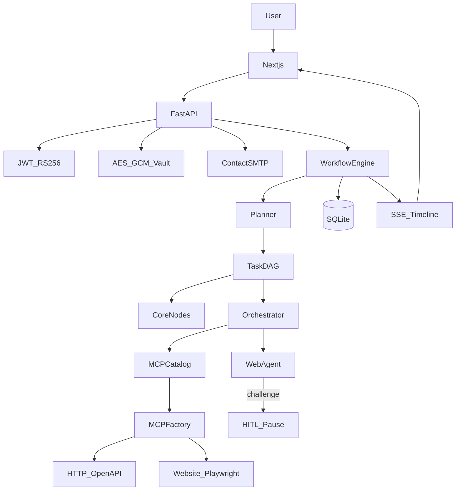

# System architecture (local)

```mermaid
flowchart TD
  user[User] --> next[Nextjs]
  next --> api[FastAPI]
  api --> auth[JWT_RS256]
  api --> vault[AES_GCM_Vault]
  api --> smtp[ContactSMTP]
  api --> engine[WorkflowEngine]
  engine --> planner[Planner]
  planner --> dag[TaskDAG]
  dag --> core[CoreNodes]
  dag --> orch[Orchestrator]
  orch --> catalog[MCPCatalog]
  catalog --> factory[MCPFactory]
  factory --> httpMcp[HTTP_OpenAPI]
  factory --> webMcp[Website_Playwright]
  orch --> webAgent[WebAgent]
  webAgent -->|challenge| hitl[HITL_Pause]
  engine --> sqlite[(SQLite)]
  engine --> sse[SSE_Timeline]
  sse --> next
```

Optional GCP (Firestore, Pub/Sub, Cloud Run) is documented in [14-terraform-gcp.md](14-terraform-gcp.md) and is not required locally.
