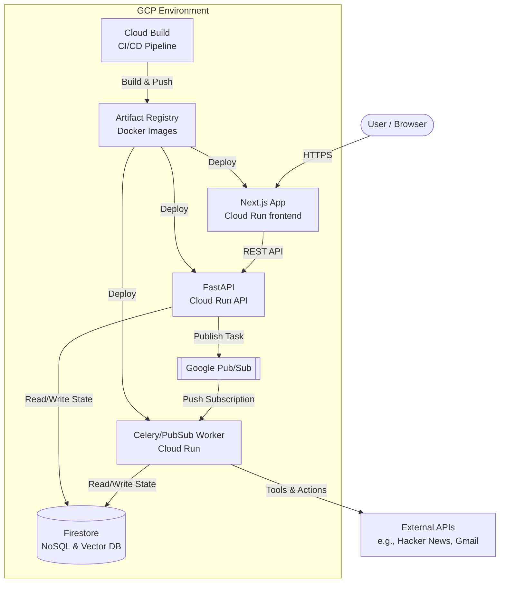

# System Architecture (C4 Context)

```mermaid
graph TD
    User([User / Browser])
    
    subgraph GCP Environment
        NextJS[Next.js App\nCloud Run frontend]
        FastAPI[FastAPI\nCloud Run API]
        Worker[Celery/PubSub Worker\nCloud Run]
        Firestore[(Firestore\nNoSQL & Vector DB)]
        PubSub[[Google Pub/Sub]]
        CloudBuild[Cloud Build\nCI/CD Pipeline]
        ArtifactRegistry[Artifact Registry\nDocker Images]
    end
    
    ExternalAPIs[External APIs\ne.g., Hacker News, Gmail]
    
    User -->|HTTPS| NextJS
    NextJS -->|REST API| FastAPI
    FastAPI -->|Publish Task| PubSub
    PubSub -->|Push Subscription| Worker
    Worker -->|Read/Write State| Firestore
    FastAPI -->|Read/Write State| Firestore
    Worker -->|Tools & Actions| ExternalAPIs
    CloudBuild -->|Build & Push| ArtifactRegistry
    ArtifactRegistry -->|Deploy| NextJS
    ArtifactRegistry -->|Deploy| FastAPI
    ArtifactRegistry -->|Deploy| Worker
```
