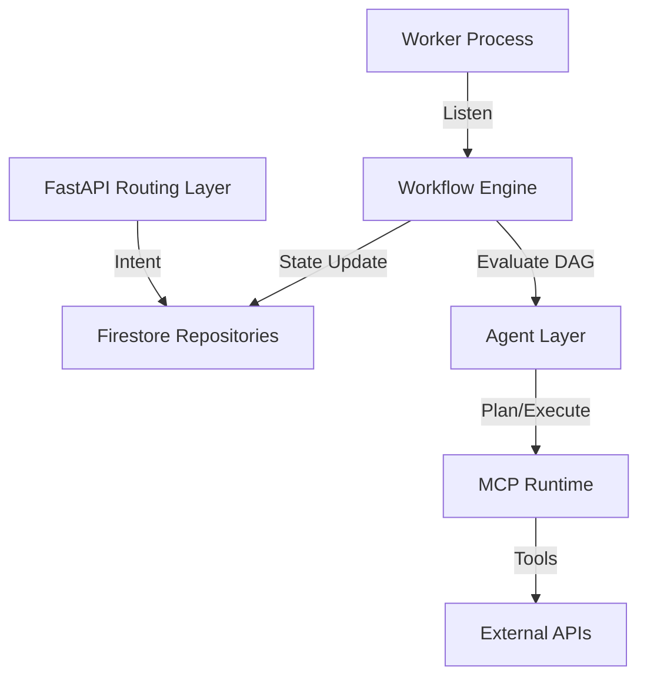

# Backend Component Diagram

```mermaid
graph TD
    API[FastAPI Routing Layer]
    Worker[Worker Process]
    Engine[Workflow Engine]
    Repo[Firestore Repositories]
    Agents[Agent Layer]
    MCP[MCP Runtime]
    
    API -->|Intent| Repo
    Worker -->|Listen| Engine
    Engine -->|Evaluate DAG| Agents
    Agents -->|Plan/Execute| MCP
    MCP -->|Tools| External[External APIs]
    Engine -->|State Update| Repo
```
