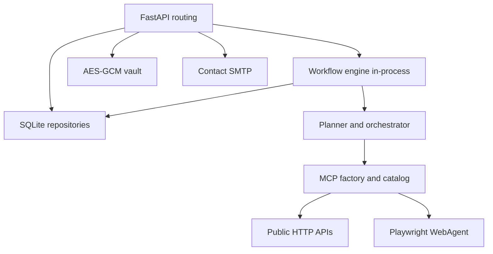

# Backend components (local)

```mermaid
graph TD
    API[FastAPI routing]
    Engine[Workflow engine in-process]
    Repo[SQLite repositories]
    Agents[Planner and orchestrator]
    MCP[MCP factory and catalog]
    Web[Playwright WebAgent]
    Vault[AES-GCM vault]
    SMTP[Contact SMTP]

    API --> Repo
    API --> Vault
    API --> SMTP
    API --> Engine
    Engine --> Agents
    Agents --> MCP
    MCP --> External[Public HTTP APIs]
    MCP --> Web
    Engine --> Repo
```

Swap repositories to Firestore with `STORAGE_BACKEND=firestore`. The laptop default is SQLite.
