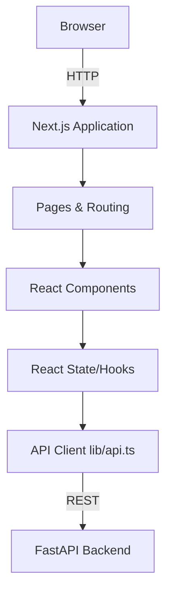

# Frontend Architecture

```mermaid
graph TD
    Client[Browser]
    NextJS[Next.js Application]
    Pages[Pages & Routing]
    Components[React Components]
    State[React State/Hooks]
    APIClient[API Client lib/api.ts]
    
    Client -->|HTTP| NextJS
    NextJS --> Pages
    Pages --> Components
    Components --> State
    State --> APIClient
    APIClient -->|REST| Backend[FastAPI Backend]
```
