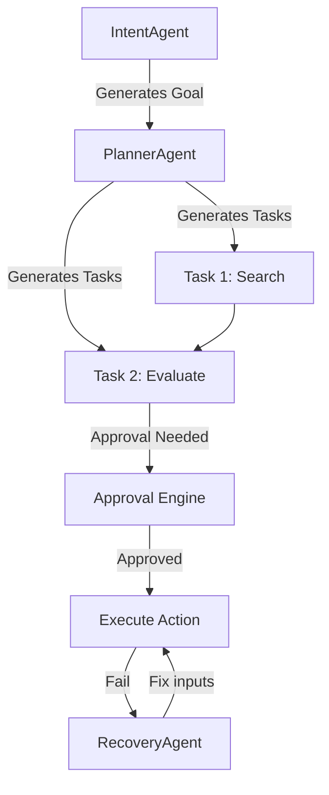

# Execution DAG

```mermaid
graph TD
    Intent[IntentAgent] -->|Generates Goal| Planner[PlannerAgent]
    Planner -->|Generates Tasks| Task1[Task 1: Search]
    Planner -->|Generates Tasks| Task2[Task 2: Evaluate]
    Task1 --> Task2
    Task2 -->|Approval Needed| Approvals[Approval Engine]
    Approvals -->|Approved| Exec[Execute Action]
    Exec -->|Fail| Recovery[RecoveryAgent]
    Recovery -->|Fix inputs| Exec
```
