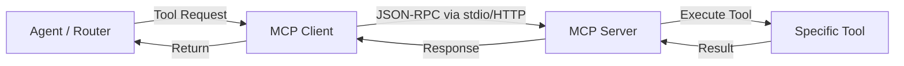

# MCP Server Flow

```mermaid
graph LR
    Agent[Agent / Router] -->|Tool Request| MCPClient[MCP Client]
    MCPClient -->|JSON-RPC via stdio/HTTP| MCPServer[MCP Server]
    MCPServer -->|Execute Tool| Tool[Specific Tool]
    Tool -->|Result| MCPServer
    MCPServer -->|Response| MCPClient
    MCPClient -->|Return| Agent
```
