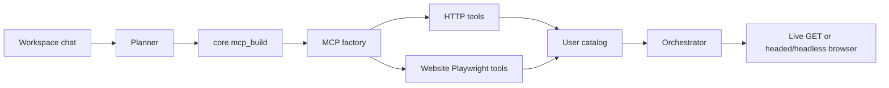

# MCP runtime (in-process catalog)

AgentOS does not spawn a separate MCP stdio server per user. The factory registers tools in the SQLite/Firestore catalog; the orchestrator calls them through the in-process tool router.

External MCP servers (JSON-RPC over stdio) remain a possible future adapter, not the local path.
