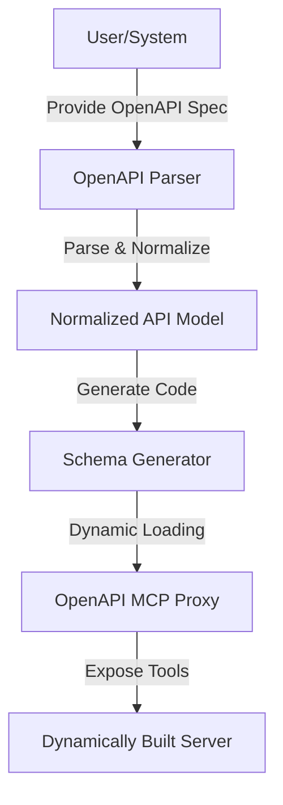

# Dynamic MCP Builder Flow

```mermaid
graph TD
    User[User/System] -->|Provide OpenAPI Spec| Parser[OpenAPI Parser]
    Parser -->|Parse & Normalize| Model[Normalized API Model]
    Model -->|Generate Code| SchemaGen[Schema Generator]
    SchemaGen -->|Dynamic Loading| Proxy[OpenAPI MCP Proxy]
    Proxy -->|Expose Tools| MCPServer[Dynamically Built Server]
```
