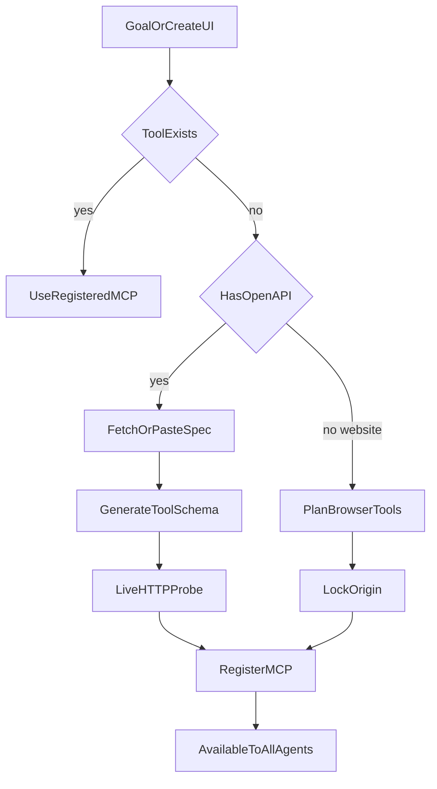

# Dynamic MCP builder

```mermaid
flowchart TD
  goal[GoalOrCreateUI] --> exists{ToolExists}
  exists -->|yes| use[UseRegisteredMCP]
  exists -->|no| kind{HasOpenAPI}
  kind -->|yes| ingest[FetchOrPasteSpec]
  ingest --> schema[GenerateToolSchema]
  schema --> probe[LiveHTTPProbe]
  probe --> register[RegisterMCP]
  kind -->|no website| plan[PlanBrowserTools]
  plan --> origin[LockOrigin]
  origin --> register
  register --> catalog[AvailableToAllAgents]
```

HTTP path: OpenAPI, docs URL, or a prompt that sketches a spec. Website path: Playwright tools on one origin. No hidden official API is invented.
