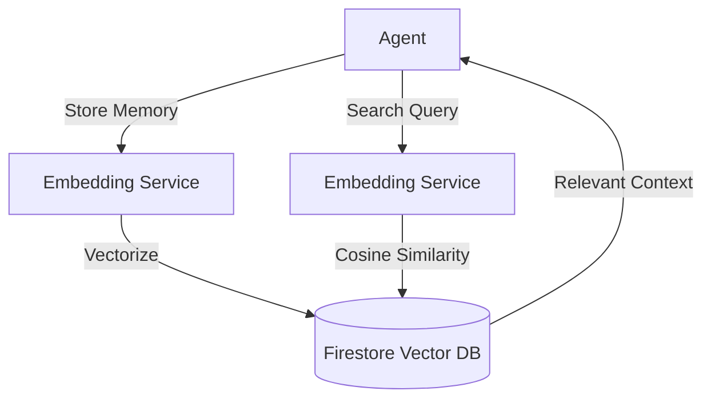

# Memory/Vector Database Flow

```mermaid
graph TD
    Agent[Agent] -->|Store Memory| Embed[Embedding Service]
    Embed -->|Vectorize| DB[(Firestore Vector DB)]
    Agent -->|Search Query| Embed2[Embedding Service]
    Embed2 -->|Cosine Similarity| DB
    DB -->|Relevant Context| Agent
```
