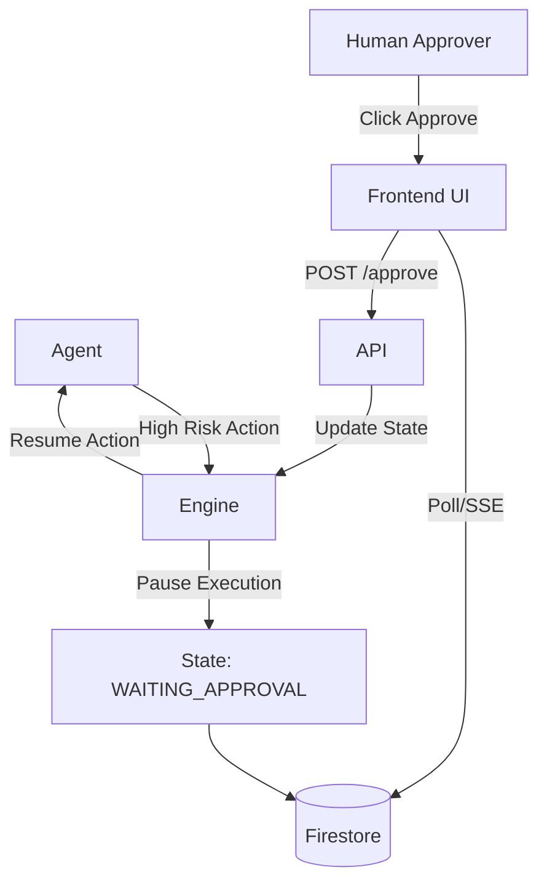

# Security Approvals Flow

```mermaid
graph TD
    Agent -->|High Risk Action| Engine
    Engine -->|Pause Execution| Status[State: WAITING_APPROVAL]
    Status --> DB[(Firestore)]
    UI[Frontend UI] -->|Poll/SSE| DB
    User[Human Approver] -->|Click Approve| UI
    UI -->|POST /approve| API
    API -->|Update State| Engine
    Engine -->|Resume Action| Agent
```
