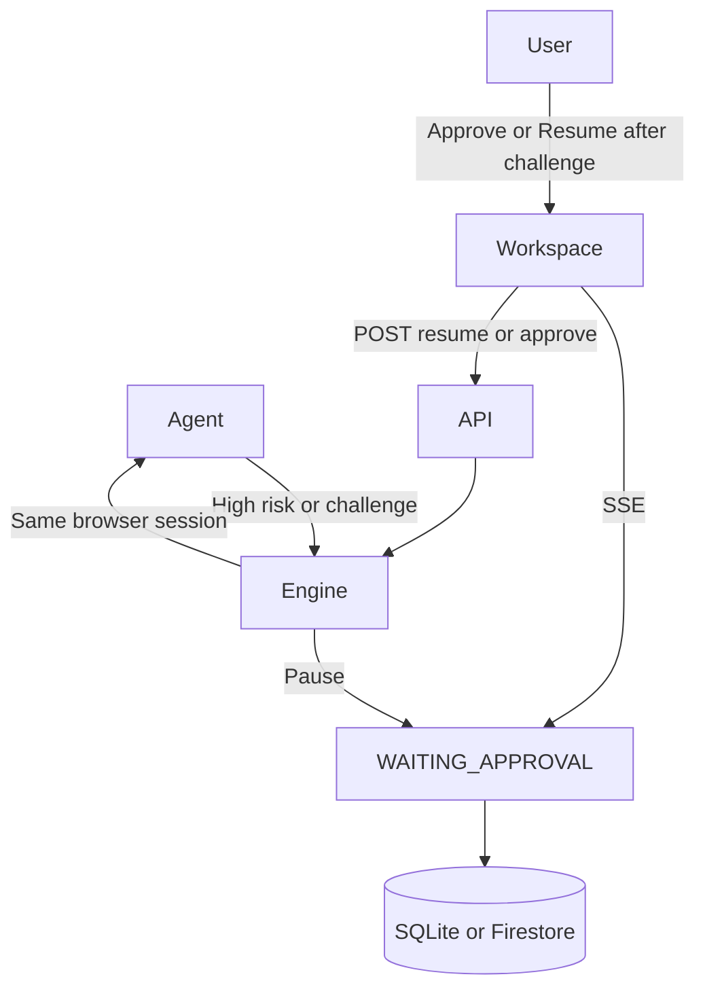

# Security approvals and HITL

High-risk tools and auth walls both pause the run. CAPTCHA/OTP/MFA use the same `WAITING_APPROVAL` status as explicit approvals.

Local default store is SQLite. Completing CAPTCHA in a different browser does not resume the agent session.
