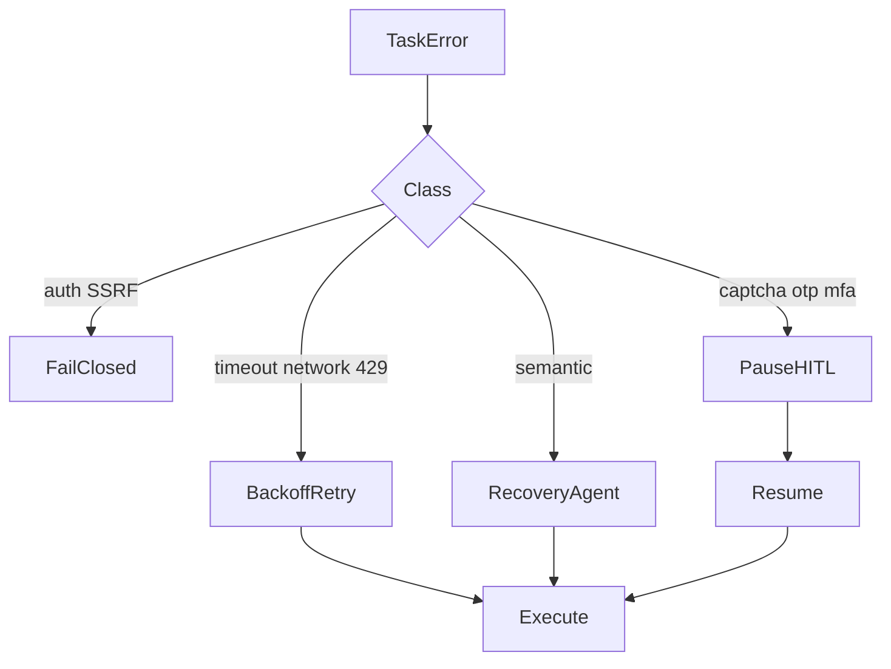

# Self-healing recovery

Local default: new tasks have `recovery_enabled=true`. Timeouts, network errors, and 429/quota retry with backoff. Semantic errors can enter RECOVERING.

Not retried: SSRF, 401/403, and CAPTCHA/OTP/MFA (HITL pause instead). Missing-tool plans usually insert `core.mcp_build` before the orchestrator.

Optional GCP Pub/Sub recovery workers are not required for SQLite mode.

