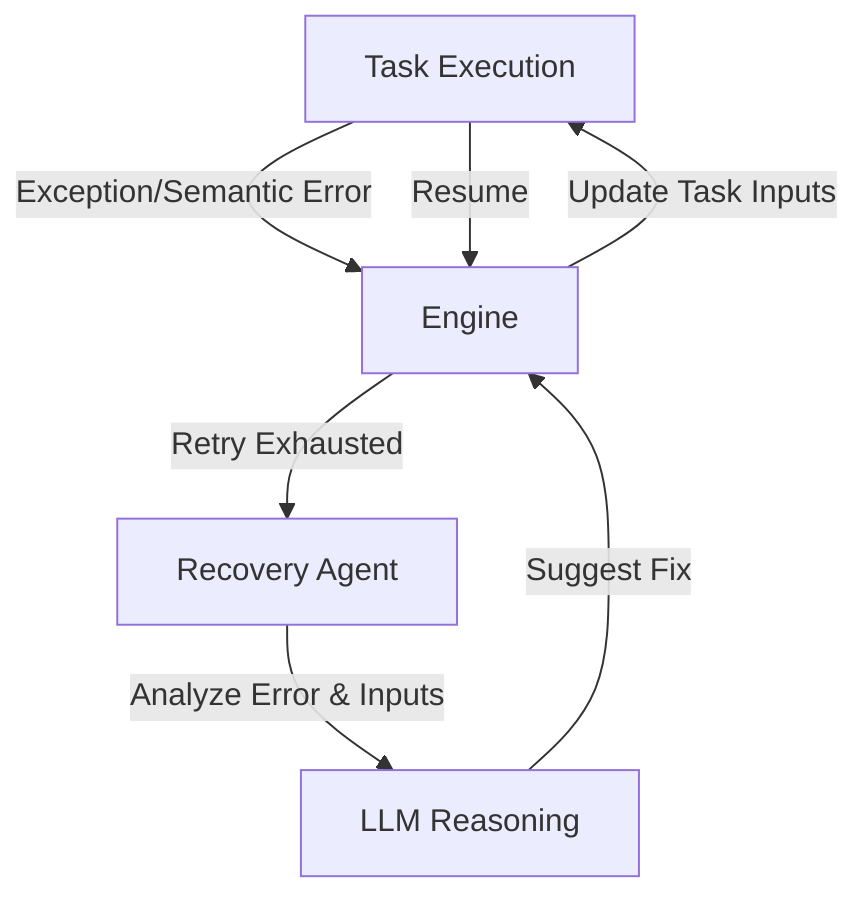

# Self-Healing Recovery Flow

```mermaid
graph TD
    Task[Task Execution] -->|Exception/Semantic Error| Engine
    Engine -->|Retry Exhausted| Recovery[Recovery Agent]
    Recovery -->|Analyze Error & Inputs| LLM[LLM Reasoning]
    LLM -->|Suggest Fix| Engine
    Engine -->|Update Task Inputs| Task
    Task -->|Resume| Engine
```
