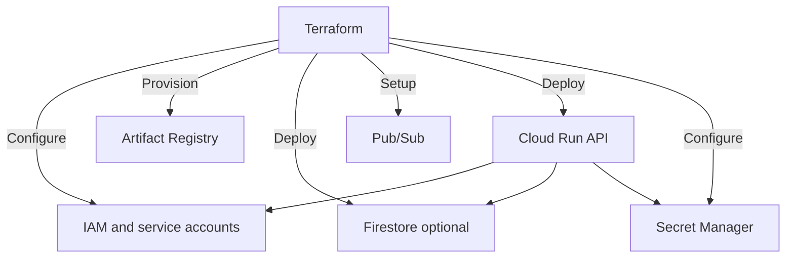

# Terraform GCP (optional)

Laptop AgentOS does not need this. Use it when you want IAM, Artifact Registry, Secret Manager, Firestore, Pub/Sub, and Cloud Run in one apply.

For a **$150 credit** contest demo, prefer the single Cloud Run API in [deploy-gcp.md](../deploy-gcp.md) (`min-instances 0`). Terraform’s worker with `min_instances = 1` will bill all day.

Secrets mapped into Cloud Run: `GEMINI_API_KEY`, `CONTACT_SMTP_PASSWORD`, `SECRETS_MASTER_KEY`, plus CORS. Never apply with a Gmail login password as a secret value — App Password only.

Python currently runs the engine **inside** the API process. A second `agenticos-worker` service is optional; keep it scaled to zero until a Pub/Sub worker is implemented.
