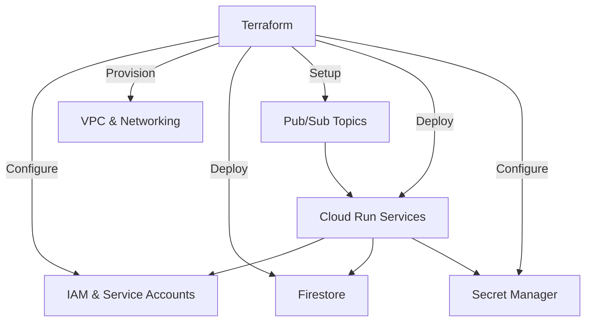

# Terraform GCP Deployment Architecture

```mermaid
graph TD
    TF[Terraform]
    TF -->|Configure| IAM[IAM & Service Accounts]
    TF -->|Provision| Network[VPC & Networking]
    TF -->|Deploy| DB[Firestore]
    TF -->|Setup| PubSub[Pub/Sub Topics]
    TF -->|Deploy| CR[Cloud Run Services]
    TF -->|Configure| Secrets[Secret Manager]
    CR --> IAM
    CR --> DB
    CR --> Secrets
    PubSub --> CR
```
