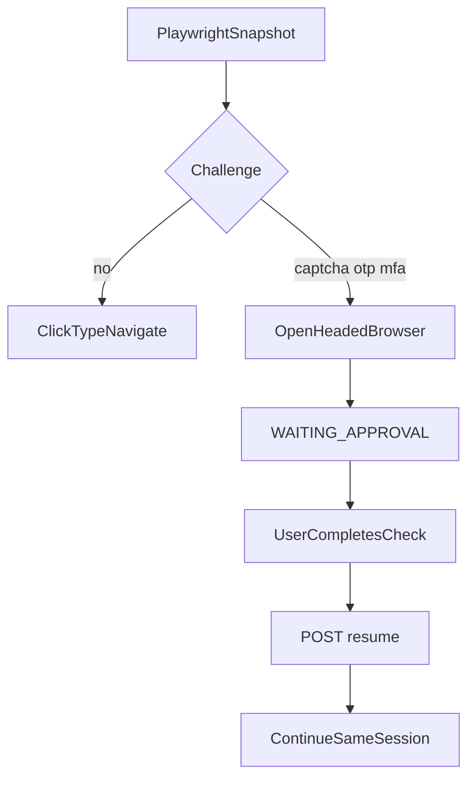

# HITL for CAPTCHA, OTP, and MFA

AgentOS does not solve these. It pauses.

Workspace shows a banner and **Resume after challenge**. Completing the check in another browser does not update the agent’s session.
