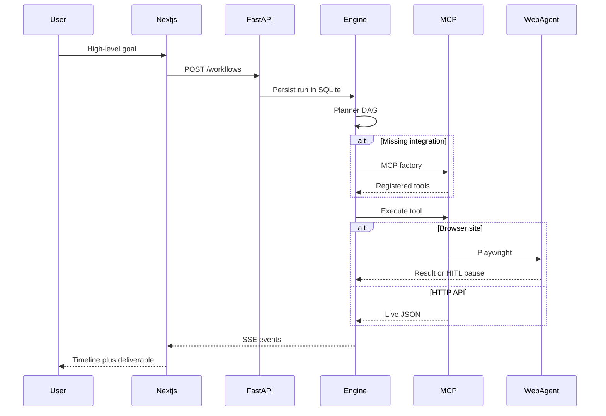

# Workflow and data flow

```mermaid
sequenceDiagram
  participant U as User
  participant UI as Nextjs
  participant API as FastAPI
  participant E as Engine
  participant M as MCP
  participant W as WebAgent
  U->>UI: High-level goal
  UI->>API: POST /workflows
  API->>E: Persist run in SQLite
  E->>E: Planner DAG
  alt Missing integration
    E->>M: MCP factory
    M-->>E: Registered tools
  end
  E->>M: Execute tool
  alt Browser site
    M->>W: Playwright
    W-->>E: Result or HITL pause
  else HTTP API
    M-->>E: Live JSON
  end
  E-->>UI: SSE events
  UI-->>U: Timeline plus deliverable
```
